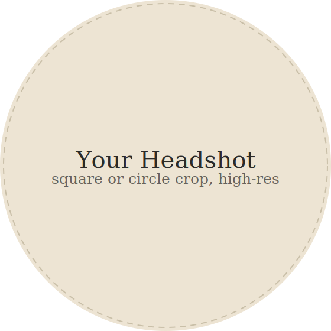

# Your Website — How Everything Works

This is a plain guide, written for someone who has never coded. Nothing here
requires installing a code editor or using a command line — you can do all
of it through your web browser. Come back to this file anytime.

---

## 1. What's in this folder

```
website/
├── index.html          ← Home page
├── about.html           ← About page
├── publications.html    ← Publications page
├── editorial.html       ← Editorial page
├── cv.html               ← CV page
├── contact.html         ← Contact page
├── css/style.css        ← All colors, fonts, spacing — one file controls the whole site's look
├── js/script.js         ← The interactive bits (help tab, mobile menu, publication circle)
└── images/               ← All photos, organized in folders per page
    ├── home/
    ├── about/
    ├── publications/
    ├── editorial/
    ├── cv/
    └── contact/
```

Every page right now uses **placeholder images** (light tan boxes with
labels like "Your Headshot") so you can see the layout before your real
photos are in. Nothing is broken — that's expected.

---

## 2. Preview the site on your own computer (before publishing)

You don't need to publish to see it. Just find the `website` folder on your
computer and **double-click `index.html`**. It will open in your browser
(Chrome, Safari, etc.) and behave exactly like the live site — click the red
help tab, resize the window to see the mobile menu, etc.

Every time you make a change and save the file, just refresh the browser
tab to see the update.

---

## 3. Editing text

Every page is an `.html` file, which you can open with any plain text
editor — on a Mac, **TextEdit** works if you use "Format → Make Plain
Text" first; on Windows, **Notepad** works fine. (If you want a nicer
editor later, a free one called **VS Code** is worth installing, but it's
not required.)

To change text: open the file, use your editor's "Find" (Cmd/Ctrl+F) to
locate the sentence you want to change (search for a few words you can see
on the live page), edit the words between the `<` `>` tags, and save.

**Rule of thumb:** only change text that sits *between* tags, like:
```html
<h1>Your Name</h1>
```
becomes
```html
<h1>Jane Smith</h1>
```
Don't delete the `<h1>` or `</h1>` parts themselves — those tell the
browser how to style the text.

---

## 4. Swapping in your real photos

Each placeholder image is referenced by a line like this in the HTML:
```html

```

To replace it:
1. Save your real photo into the matching folder (e.g. `images/home/`).
   JPG or PNG both work fine. Keep file sizes reasonable — under 1–2MB per
   photo keeps the site fast (most phone photos will need resizing/export
   at a smaller size; any free tool like Preview on Mac or the Windows
   Photos app can "export/resize" an image).
2. Rename your photo to match, e.g. `headshot.jpg`, OR keep your own
   filename and just update the `src=` in the HTML to match it exactly
   (including the folder path).
3. Save the HTML file and refresh your browser to check it looks right.

Where each placeholder lives:

| Section | File(s) to replace |
|---|---|
| Home — headshot | `images/home/headshot.svg` |
| Home — Columbia grad photo | `images/home/grad-photo.svg` |
| Home — Betsy & Bernie | `images/home/betsy-bernie.svg` |
| Home — notepad writing | `images/home/notepad.svg` |
| About — old ticket | `images/about/ticket.svg` |
| Publications — 6 logos | `images/publications/logo-1.svg` through `logo-6.svg` (add more by copying a line in `publications.html`) |
| Editorial — hero image | `images/editorial/hero.svg` |
| Contact — photo booth photo | `images/contact/photobooth.svg` |

---

## 5. Changing colors and fonts

Open `css/style.css` and look at the very top — the `:root { ... }` block.
Every color and font on the whole site is controlled from these few lines:

```css
--color-bg: #F4EEE2;        /* page background */
--color-accent: #B3271C;    /* the red — help tab, links, highlights */
--font-display: 'Archivo', ...;    /* name, nav, headers, body text */
--font-body: 'Archivo', ...;       /* same family, structural role */
--font-accent: 'Newsreader', ...;  /* italic — one emphasized line per page */
--font-hand: 'Caveat', ...;        /* handwritten photo captions, doodle labels */
--font-mono: 'Courier Prime', ...; /* dates, footer, ticket text, form fields */
```

The site currently uses a four-font system pulled from your vibe photo:
**Archivo** for the structural stuff (your name, the nav, headers, and
regular paragraph text), **Newsreader** italic for a single flowing accent
line on each page (look for the `class="lede"` paragraphs, and the help
tab's message), **Caveat** for handwritten touches (the photo captions on
the Home page, the "My Work" label in the Publications circle), and
**Courier Prime** for anything document/metadata-like (the footer, CV
dates, contact form fields).

To change a color, replace the hex code (like `#B3271C`) with a new one.
A free color picker like [coolors.co](https://coolors.co) or
[htmlcolorcodes.com](https://htmlcolorcodes.com) will give you hex codes
you can paste in directly.

To change any of the four fonts:
1. Go to [Google Fonts](https://fonts.google.com), pick a font, click it,
   and copy the `<link>` code it gives you.
2. Paste that `<link>` into the `<head>` section of **every** HTML file,
   replacing the existing Google Fonts `<link>` line (or add your new
   font's `family=...` segment onto the existing link's URL alongside the
   others, separated by `&family=`).
3. Update the matching `--font-*` variable in `style.css` to the new
   font's name.

To add a handwritten caption to a new photo, or change one of the existing
ones, just edit the text inside the `<figcaption>` tag next to that photo
in the HTML — no CSS needed.

---

## 6. Editing links

- **Publications:** in `publications.html`, each logo is wrapped in
  `<a href="#" ...>` — replace `#` with the real URL of the published piece.
  There are three separate spots using the same logos (the circle, the
  mobile grid, and the text list) — update all three so they match.
- **Socials / Substack:** in `about.html` and `contact.html`, find the
  `.socials` section and replace each `href="#"`.
- **LinkedIn:** in `cv.html`, replace the `href="#"` on the "View on
  LinkedIn" button.
- **Columbia video:** in `about.html`, replace the iframe `src` with your
  own YouTube/Vimeo embed link. On YouTube: open the video → Share →
  Embed → copy the URL inside `src="..."`.

---

## 7. Making the contact form actually send emails

GitHub Pages only hosts static files — it can't run the code needed to
send an email from a form. The **mailto link** on the Contact page
(`you@example.com`) works immediately with no setup.

If you also want the form itself to work: sign up free at
[formspree.io](https://formspree.io), create a form, and they'll give you
a URL like `https://formspree.io/f/abc123`. Paste that into `contact.html`
in place of `https://formspree.io/f/your-form-id`. Formspree's free plan
covers a personal site easily.

---

## 8. Publishing to GitHub Pages (no coding required)

1. **Create a GitHub account** at [github.com](https://github.com) if you
   don't have one (free).
2. **Create a new repository:** click the "+" in the top right → "New
   repository." Name it something like `your-name-website`. Leave it
   Public. Click "Create repository."
3. **Upload your files:** on the new repo's page, click "uploading an
   existing file." Drag your entire `website` folder's *contents* (not the
   folder itself — the `index.html`, `css`, `js`, `images` etc. should sit
   at the top level of the repo) into the upload area. Scroll down, click
   "Commit changes."
4. **Turn on GitHub Pages:** go to the repo's "Settings" tab → "Pages" in
   the left sidebar. Under "Branch," choose `main` and folder `/ (root)`,
   then click "Save."
5. Wait about a minute, then refresh that Pages settings screen — it will
   show your live URL, something like:
   `https://yourusername.github.io/your-name-website/`
6. That's it — your site is live and shareable.

**Making future updates:** in your repo, click into any file (e.g.
`about.html`), click the pencil ("Edit") icon, make your change, and
click "Commit changes" at the bottom. GitHub Pages will automatically
republish within a minute or two. To swap a photo, delete the old one and
use "Add file → Upload files" to add the new one in the same folder.

---

## 9. Getting help later

Come back to this conversation anytime — I can help you write bio copy,
pick colors from your vision board, resize photos, add more publications,
troubleshoot a GitHub Pages hiccup, or add entirely new sections.
